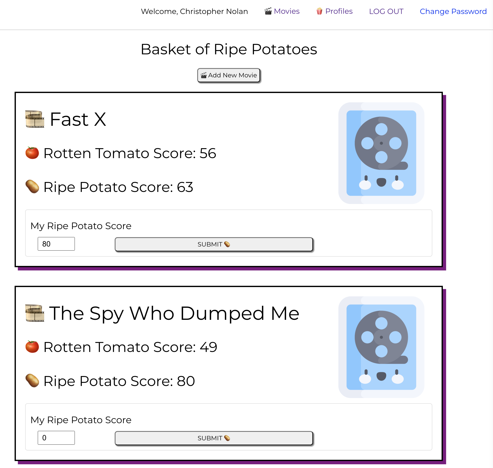

# Ripe Potatoes
Culturally relevant, critically irrelevant.

Welcome to "Ripe Potatoes," the ultimate destination for movie enthusiasts seeking honest and insightful reviews of films that may have received a Rotten Tomato score of less than 60. Here at Ripe Potatoes, we understand that critical acclaim doesn't always align with personal taste, and we aim to provide a platform where movies with lower scores can still find their audience.

# Getting Started

## Rate your [Ripe Potatoes](https://ripepotatoes.netlify.app/ "Ripe Potatoes link")

#### Project planning [here](https://trello.com/b/NyTZ3VPn/reelvibes "Trello Board")

#### Back-end [here](https://github.com/jbot010/ripepotato-back-end)

## Client
* [Lizzie Heyboer](https://www.linkedin.com/in/lizzieheyboer/)

## Credits 🥔
* [Decoupled MERN Stack with JWT Auth Template - Front End](https://github.com/SEI-Remote/decoupled-pern-jwt-auth-template-front-end-ts)
* [Decoupled MERN Stack with JWT Auth Template - Back End](https://github.com/SEI-Remote/decoupled-pern-jwt-auth-template-back-end-cjs)
* [Ripe Potato Logo](https://www.brandcrowd.com/maker/logo/84315490-f703-4bb2-a8c4-dafe0b855354/draft/fc8a462f-0d25-42cc-8b08-0fbfef242b47)
* [Cloudinary](https://cloudinary.com/)
* [Icons](https://www.flaticon.com/)

## Technologies used 💻
* TypeScript
* React
* PostgreSQL
* Express
* Sequelize
* Supabase
* bcrypt
* JWT
* JavaScript
* HTML
* CSS
* Fly.io
* Netlify
* Git
* GitHub
* Chrome DevTools
* Cloudinary

## Next Steps 🔮
- [ ] Connect Movie API
- [ ] Add Reviews
- [ ] Expand Profile features
- [ ] Create Movie lists