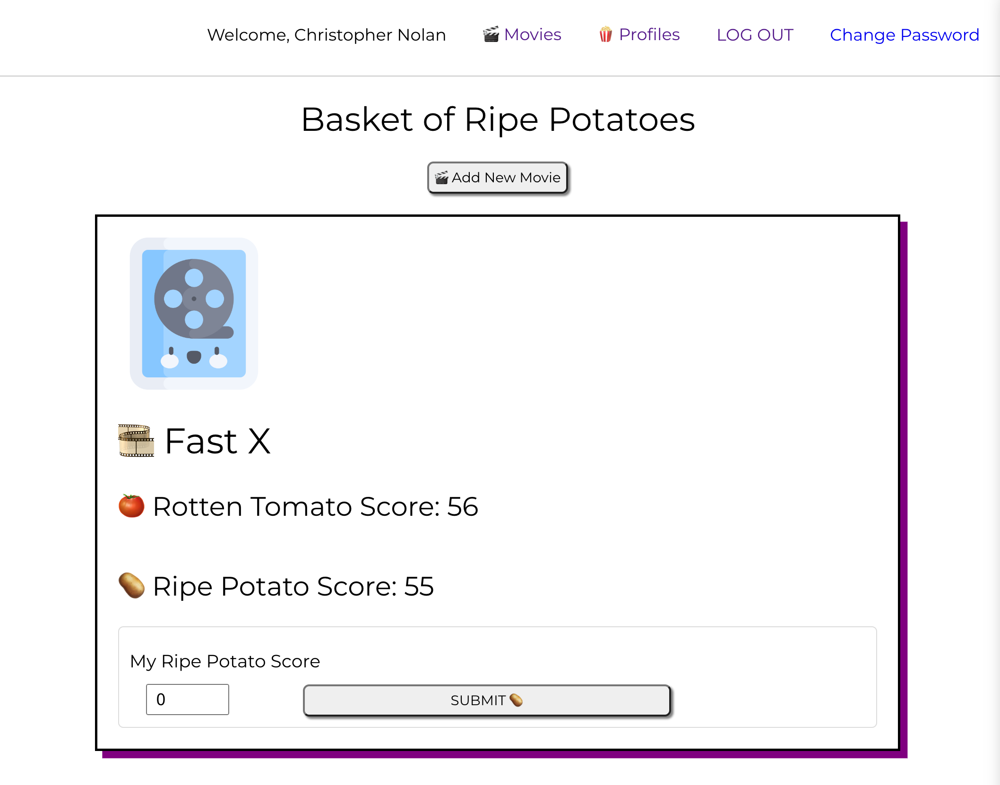

# Ripe Potato
Culturally relevant, critically irrelevant.

# Getting Started

## Build your [BarkBase](https://ripepotato.netlify.app/ "Ripe Potatoe link")

#### Project planning [here](https://trello.com/b/NyTZ3VPn/reelvibes "Trello Board")

#### Back-end [here](https://github.com/jbot010/ripepotato-back-end)

## Credits 🥔
* [Decoupled MERN Stack with JWT Auth Template - Front End](https://github.com/SEI-Remote/decoupled-pern-jwt-auth-template-front-end-ts)
* [Decoupled MERN Stack with JWT Auth Template - Back End](https://github.com/SEI-Remote/decoupled-pern-jwt-auth-template-back-end-cjs)
* [Ripe Potato Logo](https://www.brandcrowd.com/maker/logo/84315490-f703-4bb2-a8c4-dafe0b855354/draft/fc8a462f-0d25-42cc-8b08-0fbfef242b47)
* [Cloudinary](https://cloudinary.com/)
* [Icons](https://www.flaticon.com/)

## Technologies used 💻
* TypeScript
* React
* Material UI
* Node.js
* Express
* Mongoose
* MongoDB
* bcrypt
* JWT
* JavaScript
* HTML
* CSS
* Fly.io
* Netlify
* Git
* GitHub
* Chrome DevTools
* Cloudinary

## Next Steps 🔮
- [ ] Connect Movie API